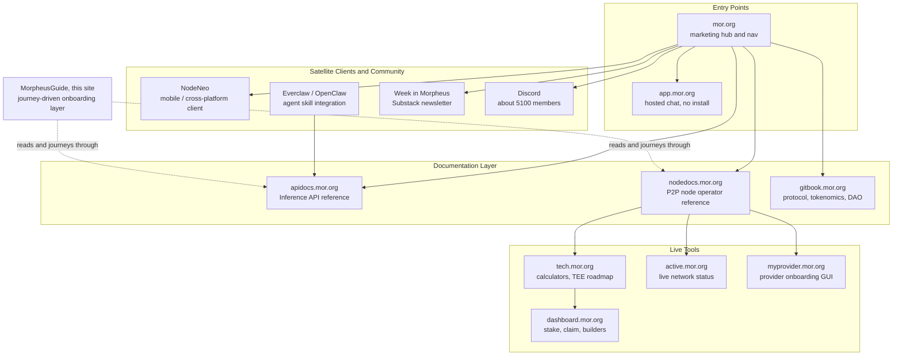

Morpheus isn't one website. It's about a dozen separate properties — docs sites,
calculators, dashboards, a mobile client, a newsletter — and nothing official ties
them together in one picture. This page is that picture, built by reading each
property's own navigation and cross-links rather than any single source.

<Note>
  This is an orientation aid, not a technical reference. For the authoritative
  description of any one property, follow its link below.
</Note>

---

## The Map

<Warning>
  **Not pictured, deliberately: morlord.com.** It's named in this prototype's own
  planning notes as an "analytics" layer, but it never appears once across either
  audited documentation site's navigation or cross-links. Verify it's still current
  before referencing it anywhere.
</Warning>

---

## What Each One Actually Does

<AccordionGroup>
  <Accordion title="mor.org — the entry point">
    The marketing hub and main navigation for the whole ecosystem. Blog posts,
    product links, and the jumping-off point to almost everything else on this page.
  </Accordion>
  <Accordion title="app.mor.org — hosted chat, no install">
    A zero-install, no-wallet-required chat interface. Uses credit-based billing
    instead of on-chain sessions — the same account system behind the
    [API Gateway path](/api-gateway/windows) this site documents.
  </Accordion>
  <Accordion title="apidocs.mor.org — Inference API reference">
    Official reference for the hosted Morpheus Inference API — the API Gateway path.
    No wallet, no node, credit-based billing. This site's API Gateway guides sit on
    top of this reference rather than duplicating it.
  </Accordion>
  <Accordion title="nodedocs.mor.org — P2P node operator reference">
    Official technical reference for the Native P2P network — consumer, prosumer, and
    provider documentation for the Lumerin Node. This site's Native Path guides sit
    on top of this reference rather than duplicating it.
  </Accordion>
  <Accordion title="gitbook.mor.org — protocol, tokenomics, DAO">
    The deepest layer: Builders Protocol, MOR emissions, governance proposals (MRCs),
    smart contract documentation. Philosophical and economic, not operational — go
    here if you want to understand *why* the protocol is designed the way it is, not
    *how* to use it.
  </Accordion>
  <Accordion title="tech.mor.org — calculators and visual explainers">
    Interactive tools: a staking/pricing calculator, a session-lifecycle flow
    diagram, and an unusually good TEE "trust spectrum" scorecard. Referenced
    directly from [Understanding Session Economics](/native-path/understanding-session-economics).
  </Accordion>
  <Accordion title="active.mor.org — live network status">
    Model availability history, open GitHub issues, recent merges. The first place
    to check when something seems broken and you're not sure if it's you or the
    network.
  </Accordion>
  <Accordion title="dashboard.mor.org — stake, claim, builders">
    The DeFi side of MOR: Capital staking (deposit/stake/claim) and Builder subnet
    rewards. Distinct from node operation — don't confuse this with staking MOR to
    open a session, which is covered on
    [Understanding Session Economics](/native-path/understanding-session-economics).
  </Accordion>
  <Accordion title="myprovider.mor.org — provider onboarding GUI">
    A GUI wizard for registering as a provider without hand-rolling API calls. As of
    this site's last review, it has no session-monitoring or earnings dashboard yet —
    a real product gap, not just a documentation one. See the
    [Provider guide](/native-path/provider) for the fuller picture.
  </Accordion>
  <Accordion title="NodeNeo — mobile / cross-platform client">
    A consumer client for platforms the Desktop App doesn't cover. Treated as a stub
    by official docs — no screenshots or feature breakdown exist yet outside
    NodeNeo's own site.
  </Accordion>
  <Accordion title="Everclaw / OpenClaw — agent skill integration">
    The agent-skill project behind this site's OpenClaw + EverClaw setup guides
    ([Windows](/api-gateway/windows), [macOS](/api-gateway/macos),
    [Ubuntu](/api-gateway/ubuntu)). Lets AI agents consume Morpheus inference through
    a local gateway or C-Node.
  </Accordion>
  <Accordion title="Week in Morpheus — Substack newsletter">
    An active weekly roundup of ecosystem and dev updates, running since January
    2025. The most current unofficial source for "what changed recently."
  </Accordion>
  <Accordion title="Discord — community & support">
    Roughly 5,100 members with dedicated technical-support channels. The right place
    to ask when a guide's troubleshooting table doesn't cover your specific case.
  </Accordion>
</AccordionGroup>

---

## Where This Site Fits

MorpheusGuide doesn't replace any property above — it's the missing "how do I
actually start" layer sitting on top of apidocs.mor.org and nodedocs.mor.org,
journey-driven and screenshot/video-first where they're reference-first. When you
need authoritative technical detail this site doesn't cover, those two sites (linked
in the navbar) are the next stop — not a search engine.

<CardGroup cols={2}>
  <Card title="What Is Morpheus?" icon="lightbulb" href="/what-is-morpheus">
    Back to the newcomer explainer.
  </Card>
  <Card title="Get Started" icon="rocket" href="/">
    Pick your path — API Gateway or Native P2P.
  </Card>
</CardGroup>
